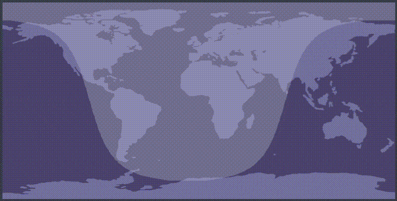

(demo gif, in reality it updates in real time)

# wlr-sunclock

wayland desktop widget to show to the sun's shadows on earth.  
uses [gtk-layer-shell](https://github.com/wmww/gtk-layer-shell) and the [layer shell protocol](https://github.com/swaywm/wlr-protocols/blob/master/unstable/wlr-layer-shell-unstable-v1.xml) to render on your desktop, behind your windows

## install from source

    pacman -S gtk-layer-shell gtk3 wayland

    meson build
    sudo ninja -C build install

## install from AUR

please see [wlr-sunclock-git](https://aur.archlinux.org/packages/wlr-sunclock-git/)

## cli args

    -a, --anchors=ANCHORS      window anchors (see below)
    -l, --layer=<background|bottom|top|overlay>
                               desktop layer to show the widget on
    -m, --margins=MARGINS      window margins
    -w, --width=WIDTH          window width
    -c, --border-colour=BORDER_COLOUR
                               window border colour (unused)
    -d, --border-width=BORDER_WIDTH
                               window border width
    -?, --help                 Give this help list
        --usage                Give a short usage message

## anchors

    -a tl   -a tr   -a br   -a bl   -a ''   -a tblr
    ┌─┬───┐ ┌───┬─┐ ┌─────┐ ┌─────┐ ┌─────┐ ╔═════╗
    ├─┘   │ │   └─┤ │     │ │     │ │ ┌─┐ │ ║     ║
    │     │ │     │ │   ┌─┤ ├─┐   │ │ └─┘ │ ║     ║
    └─────┘ └─────┘ └───┴─┘ └─┴───┘ └─────┘ ╚═════╝

## start on boot with sway example

    # ~/.config/sway/config

    exec wlr-sunclock \
       --margins "0,16,0,16" \
       --width 800 \
       --layer bottom \
       --anchors br \
       --border-width 2
