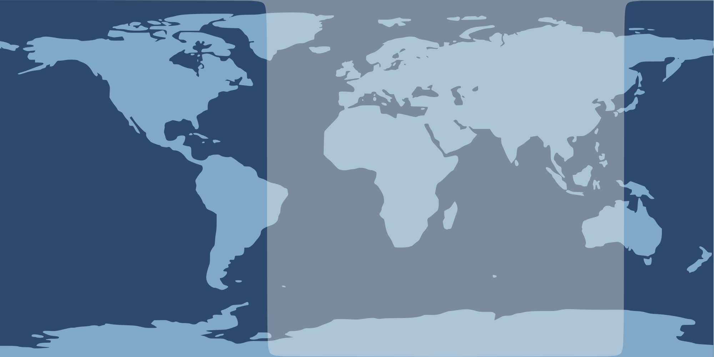
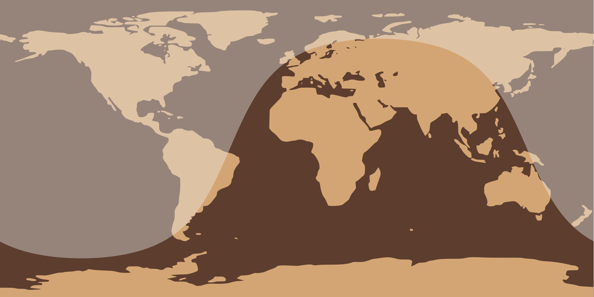
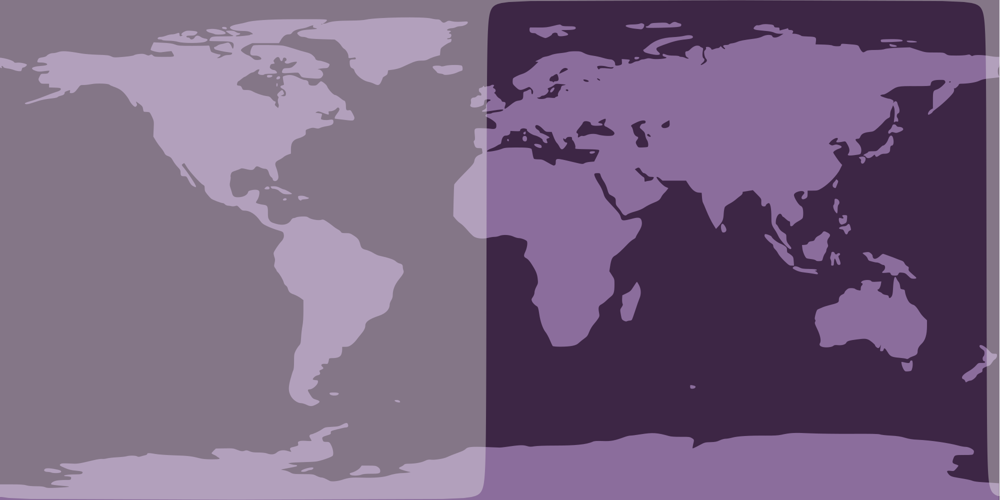
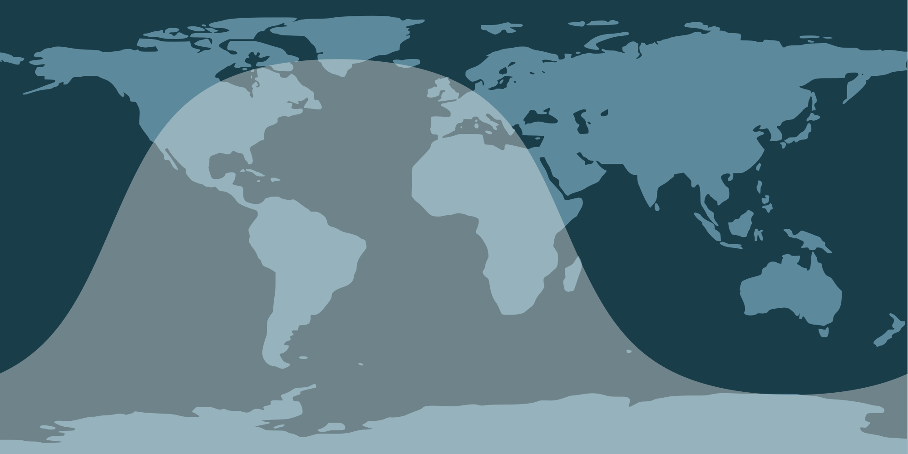

(demo gif, in reality it updates in real time)

# wlr-sunclock

wayland desktop widget to show to the sun's shadows on earth.  
uses [gtk-layer-shell](https://github.com/wmww/gtk-layer-shell) and the [layer shell protocol](https://github.com/swaywm/wlr-protocols/blob/master/unstable/wlr-layer-shell-unstable-v1.xml) to render on your desktop, behind your windows

| Spring Equinox | Summer Solstice |
|:--|:--|
|  |    |
| **Autumn Equinox** | **Winter Solstice** | 
|  |    |

## Installation

### From source

    pacman -S gtk-layer-shell gtk3 wayland librsvg

    meson build
    sudo ninja -C build install

### From AUR

please see [wlr-sunclock-git](https://aur.archlinux.org/packages/wlr-sunclock-git/)

### From OBS

please see [X11:Wayland/wlr-sunclock](https://build.opensuse.org/package/show/X11:Wayland/wlr-sunclock) for the openSUSE package

### From Fedora Copr

please see [wef/wlr-sunclock](https://copr.fedorainfracloud.org/coprs/wef/wlr-sunclock/) for a Fedora package

## CLI args

    -a, --anchors=ANCHORS                       string of window anchors (see below)
    -i, --monitor-index=MONITOR_INDEX           monitor to show window on (starts at 0)
    -l, --layer=<background|bottom|top|overlay> desktop layer to show the widget on
    -m, --margins=MARGINS                       comma separated margins for window
    -w, --width=WIDTH                           width of the window
    -d, --border-width=BORDER_WIDTH             width of the window's border
    -o, --colour-ocean=COLOUR_OCEAN             colour of the ocean
    -n, --colour-land=COLOUR_LAND               colour of the land
    -v, --version                               print version

## Anchors

    -a tl   -a tr   -a br   -a bl   -a ''   -a tblr
    ┌─┬───┐ ┌───┬─┐ ┌─────┐ ┌─────┐ ┌─────┐ ╔═════╗
    ├─┘   │ │   └─┤ │     │ │     │ │ ┌─┐ │ ║     ║
    │     │ │     │ │   ┌─┤ ├─┐   │ │ └─┘ │ ║     ║
    └─────┘ └─────┘ └───┴─┘ └─┴───┘ └─────┘ ╚═════╝

## Start on boot with sway example

    # ~/.config/sway/config

    exec wlr-sunclock \
       --margins "0,16,0,16" \
       --width 800 \
       --layer bottom \
       --anchors br \
       --border-width 2 \
       --colour-ocean "#C4B5FD" \
       --colour-land "#6D28D9"
